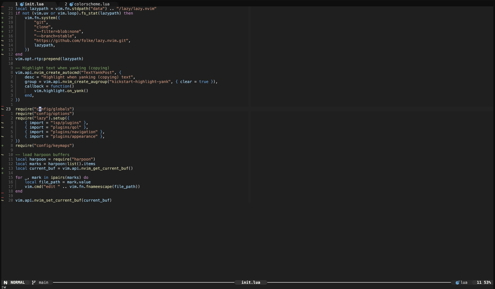
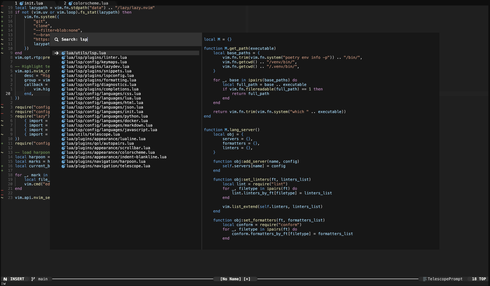

# Neovim Configuration

<table>
    <tr>
        <td></td>
        <td></td>
    </tr>
</table>

## Installation

1. Backup your current configuration (optional):

    ```sh
    mv ~/.config/nvim ~/.config/nvim-backup/
    ```

2. Clone this repository into your `~/.config/nvim` folder:

    ```sh
    git clone https://github.com/Aleks-Tacconi/nvim-config.git ~/.config/nvim
    ```
