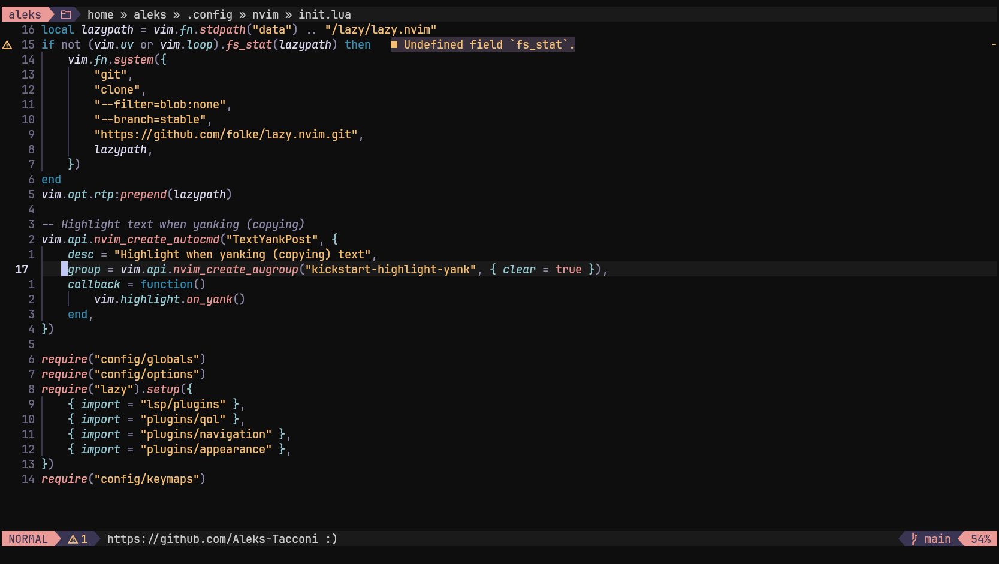

# Neovim Configuration

A personal and opinionated Neovim config. Features include:

- LSP, diagnostics, completion, and snippets
- File, buffer, and project navigation
- Git, testing, and debugging tools
- Markdown and MDX support with general editing quality-of-life

## Screenshot



## Prerequisites

Core tooling:

- Neovim (`0.12+` recommended)
- `git`
- `ripgrep`
- `fd`

Optional but useful:

- `lazygit`
- language-specific LSPs, formatters, and debuggers (See my [NixOS config](https://github.com/Aleks-Tacconi/NixOSConfig) for more details)
- for QML projects, expose your Qt/QML modules through `QML_IMPORT_PATH` or `QML2_IMPORT_PATH` so `qmlls` can resolve imports

## Setup

1. Backup your current config if you want to keep it:

    ```sh
    mv ~/.config/nvim ~/.config/nvim-backup/
    ```

2. Clone this repository into `~/.config/nvim`:

    ```sh
    git clone https://github.com/Aleks-Tacconi/nvim-config.git ~/.config/nvim
    ```

3. Sync plugins and Treesitter parsers:

    ```sh
    nvim --headless "+Lazy! sync" "+lua require('lazy').load({plugins={'nvim-treesitter'}})" "+TSUpdate" "+qa"
    ```

4. Open Neovim and let Lazy finish any first-run setup.

## Structure

- `lua/config/` for globals, options, keymaps, commands, filetypes, and autocmds
- `lua/config/dap/` for debug UI and adapter setup
- `lua/config/telescope.lua` for Telescope setup and custom pickers
- `lua/plugins/navigation/` for search and movement plugins
- `lua/plugins/qol/` for editing, git, markdown, testing, and debugging
- `lua/plugins/appearance/` for UI and theme-related plugins
- `lua/lsp/plugins/` for language tooling

## Useful Files

- General keymaps: `lua/config/keymaps.lua`
- Core autocmds: `lua/config/autocmds.lua`
- Command aliases: `lua/config/commands.lua`
- Kanagawa theme setup: `lua/plugins/appearance/kanagawa.lua`
- Telescope setup and pickers: `lua/config/telescope.lua`
- LSP keymaps: `lua/lsp/config/keymaps.lua`
- Main plugin loading: `init.lua`
